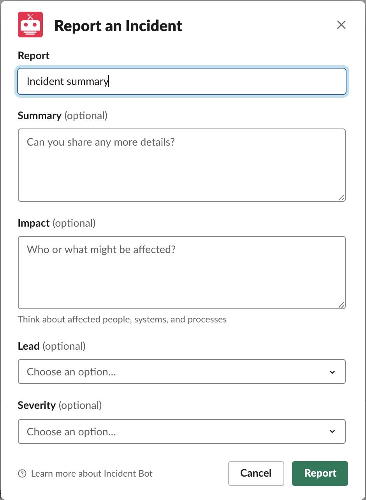
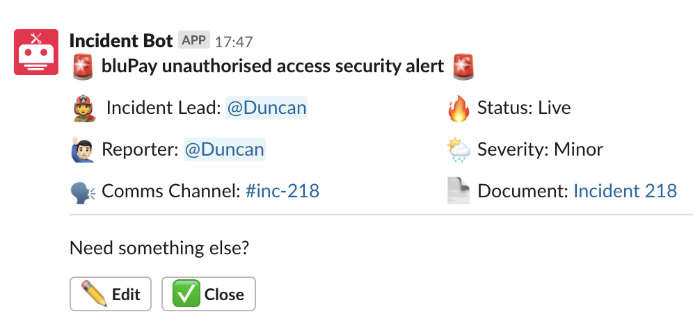

## Table of Contents
<!-- Table of contents generated generated by http://tableofcontent.eu -->
- [About](#about)
- [Usage](#usage)
- [Development](#development)
  - [Building Blocks](#building-blocks)
  - [Incident Commands: `@incident_command`](#incident-commands-incident_command)
  - [Incident Notifications: `@recurring_notification` / `@single_notification`](#incident-notifications-recurring_notification-single_notification)
  - [Keyword Handlers: `@keyword_handler`](#keyword-handlers-keyword_handler)
  - [Event Handlers: `@event_handler`](#event-handlers-event_handler)
  - [Action Handlers: `@action_handler`](#action-handlers-action_handler)


## About

Dealing with incidents can be stressful. On top of dealing with the issue at hand, responders are often responsible for handling comms, both internal and external, reporting, and coordinating the efforts of other engineers. To reduce the pressure and cognitive burden on its engineers, [Monzo built response](https://github.com/monzo/response) to help coordinate and report incidents.

We have taken this bot and have customised it to suite our response plan for running an incident.

The tool integrates deeply with Slack and revolves around the following ideals:

- Limit context switching Context switching during an incident is often unavoidable. Response aims to limit this, by enabling actions to be carried out without leaving the conversation.

- Make the easy thing the right thing If something needs doing, bring it to the attention of the responder when it makes sense, or better still automate it away.

## Usage

Anyone can start an incident from Slack by typing the command:
`/incident Incident summary`

This will create a dialog allowing you to enter addition information for the incident.



When you press "Report", it will go and create a headline post within the `#incidents` channel within Slack.




## Development

The incident bot is built using [Django](https://www.djangoproject.com/). If you're not familiar with it, there are good [docs here](https://docs.djangoproject.com/en/2.1/).

### Building Blocks

Monzo have built some useful building blocks within the Django app that makes it easier to customise.

### Incident Commands: `@incident_command`

The `@incident_command` decorator allows you to define a new incident command handler in single function.

**Example** if you wanted a command to show how long an incident had been running you'd simply need to add this one function:

```
@incident_command(['duration'], helptext='How long has this incident been running?')
def update_duration(incident: Incident, user_id: str, message: str):
    duration = incident.duration()

    comms_channel = CommsChannel.objects.get(incident=incident)
    comms_channel.post_in_channel(f"⏱ The incident has been running for {duration}")

    return True, None
```

### Incident Notifications: `@recurring_notification` / `@single_notification`

These decorators allow you to define Notifications which get posted to comms channel as specific intervals.

**Example** if you wanted to remind the engineer to take break every 15 minutes you could define a function similar to the following:

```
@recurring_notification(interval_mins=30, max_notifications=10)
def take_a_break(incident: Incident):
    comms_channel = CommsChannel.objects.get(incident=incident)
    comms_channel.post_in_channel("👋 30 minutes have elapsed. Think about taking a few minutes away from the screen.")
```

### Keyword Handlers: `@keyword_handler`

These decorators allow functions to called when a specific keyword or phrase appears in a message posted in comms channel.

**Example** if you wanted to remind people where to find your runbooks when they mention 'runbook' you could do the following:

```
@keyword_handler(['runbook', 'run book'])
def runbook_notification(comms_channel: CommsChannel, user: str, text: str, ts: str):
    comms_channel.post_in_channel("📗 If you're looking for our runbooks they can be found here https://...")
```

### Event Handlers: `@event_handler`

Slack can send events for pretty much anything going on in your team. The full list is available [here](https://api.slack.com/events), and new handlers can be added to Response by using the `@event_handler` decorator.

Examples of these can be found in [event_handlers.py](https://github.com/monzo/response/blob/master/slack/event_handlers.py).

### Action Handlers: `@action_handler`

Action handlers are used to handle button presses.  Buttons are assigned IDs when they are created (see [here](https://github.com/monzo/response/blob/master/slack/models/headline_post.py#L57)), and a handler can be linked by simply using the same ID.

```
@action_handler(HeadlinePost.CLOSE_INCIDENT_BUTTON)
def handle_close_incident(action_context: ActionContext):
    incident = action_context.incident
    incident.end_time = datetime.now()
    incident.save()
```
